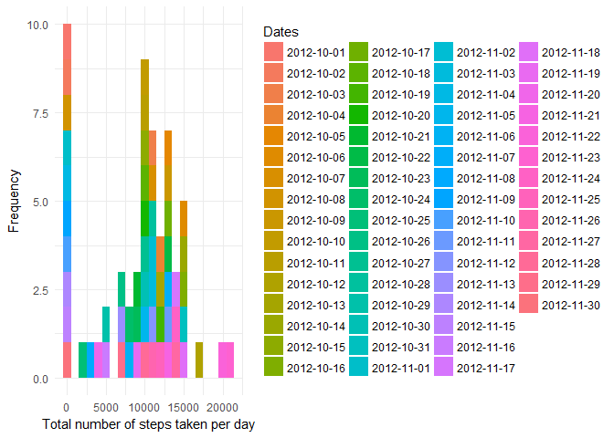
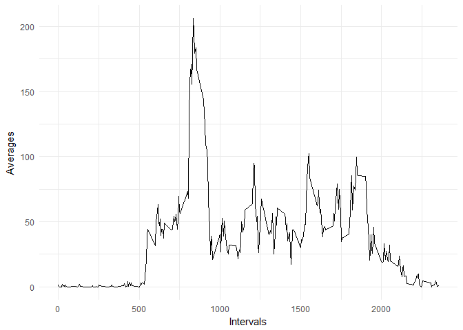
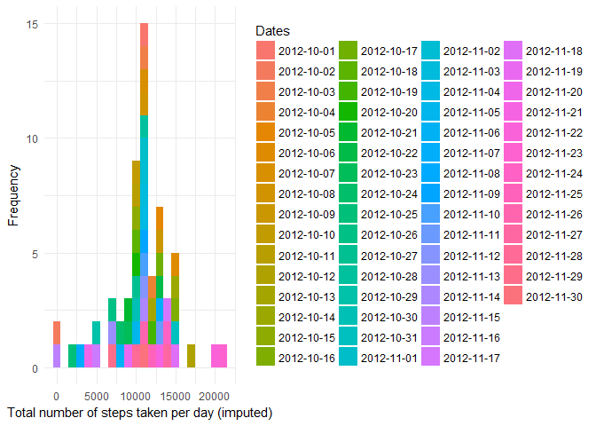
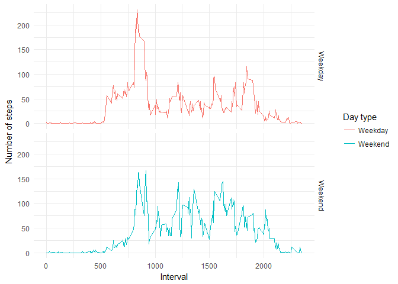

## Loading and preprocessing the data
### Preliminaries
Loading preliminary packages into R.

```r
packages <- c("dplyr", "ggplot2")
sapply(packages, require, character.only = TRUE, quietly = TRUE)
```

```
##   dplyr ggplot2 
##    TRUE    TRUE
```

Set the working directory to the repository folder and store the path in a variable.

```r
# The working directory should be set here
setwd("~/Data Science/RepData_PeerAssessment1")
path = file.path(getwd(), "activity.zip")
```

### Getting the data
First, check if the CSV file exists and load it into `activity`. If the `.zip` exists and not the CSV, un-zip the file and load the CSV. If the `.zip` does not exist, download it.

```r
if (file.exists("activity.csv")) {
  activity <- read.csv("activity.csv")
} else if (file.exists("activity.zip")) {
  executable <- file.path("C:", "Program Files", "7-Zip", "7z.exe")
  parameters <- "x"
  cmd <- paste(paste0("\"", executable, "\""), parameters, paste0("\"", path, "\""))
  system(cmd)
  activity <- read.csv("activity.csv")
} else {
  url <- "https://d396qusza40orc.cloudfront.net/repdata%2Fdata%2Factivity.zip"
  download.file(url, path)
  executable <- file.path("C:", "Program Files", "7-Zip", "7z.exe")
  parameters <- "x"
  cmd <- paste(paste0("\"", executable, "\""), parameters, paste0("\"", path, "\""))
  system(cmd)
  activity <- read.csv("activity.csv")
}
```

*Read the `README.md` file in the repository for more information on the dataset.*

### Tidying the data
The data here just consists of three variables and are formatted correctly. However, the time column is coerced into `POSIXct` format.

```r
activity$date <- as.POSIXct(as.character(activity$date))
```
Then, the data is grouped by the date.

```r
activity <- tbl_df(activity)
activity <- group_by(activity, date)
activity
```

```
## # A tibble: 17,568 x 3
## # Groups:   date [61]
##    steps date                interval
##    <int> <dttm>                 <int>
##  1    NA 2012-10-01 00:00:00        0
##  2    NA 2012-10-01 00:00:00        5
##  3    NA 2012-10-01 00:00:00       10
##  4    NA 2012-10-01 00:00:00       15
##  5    NA 2012-10-01 00:00:00       20
##  6    NA 2012-10-01 00:00:00       25
##  7    NA 2012-10-01 00:00:00       30
##  8    NA 2012-10-01 00:00:00       35
##  9    NA 2012-10-01 00:00:00       40
## 10    NA 2012-10-01 00:00:00       45
## # ... with 17,558 more rows
```

## What is mean total number of steps taken per day?
### Plotting
The mean number of total steps is calculated directly from the data frame. Before statistical calculations, a histogram is plotted.

```r
totalSteps <- with(activity, tapply(steps, date, sum, na.rm = TRUE))
```


```r
qplot(totalSteps, binwidth = 1000, xlab = "Total number of steps taken per day",
      ylab = "Frequency", fill = names(totalSteps)) + labs(fill = "Dates") + theme_minimal()
```

<!-- -->

### Calculations
The simple mean and median are then calculated.

```r
mean(totalSteps, na.rm = TRUE)
```

```
## [1] 9354.23
```

```r
median(totalSteps, na.rm = TRUE)
```

```
## [1] 10395
```

## What is the average daily activity pattern?
### Processing
The step averages by interval are computed using the base `tapply` function. The result is stored in a data frame `averages` along with the corresponding intervals.

```r
averages <- tbl_df(data.frame(interval = unique(activity$interval),
                              average = tapply(activity$steps, activity$interval,
                              FUN = mean, na.rm = TRUE)))
averages
```

```
## # A tibble: 288 x 2
##    interval average
##  *    <int>   <dbl>
##  1        0  1.72  
##  2        5  0.340 
##  3       10  0.132 
##  4       15  0.151 
##  5       20  0.0755
##  6       25  2.09  
##  7       30  0.528 
##  8       35  0.868 
##  9       40  0     
## 10       45  1.47  
## # ... with 278 more rows
```

### Plotting
The data from the frame is taken and incorporated into a line plot.

```r
qplot(interval, average, data = averages, geom = "line", xlab = "Intervals", ylab = "Averages") + theme_minimal()
```

<!-- -->

### Calculations
The interval for the highest average steps is then calculated.


```r
averages[which.max(averages$average), ]
```

```
## # A tibble: 1 x 2
##   interval average
##      <int>   <dbl>
## 1      835    206.
```

## Imputing missing values

### The `impute` function
This helper function is written in order to help with processing of the `NA` data. It is used in conjunction with an `*apply` function.


```r
impute <- function(steps, interval) {
  value <- NA
  if (is.na(steps)) {
    value <- averages[averages$interval == interval, "average"]
  } else {
    value <- c(steps)
  }
  
  return (value)
}
```

### Processing
The imputing will be done as per a mean basis. The `NA` values in the dataset are found and then replaced with the average value for that interval. Note how the average values for each interval are already stored in `averages`. The imputed values are stored in a new dataset, `myactivity`.


```r
myactivity <- activity
myactivity$steps <- with(activity, unlist(mapply(impute, steps, interval)))
myactivity
```

```
## # A tibble: 17,568 x 3
## # Groups:   date [61]
##     steps date                interval
##     <dbl> <dttm>                 <int>
##  1 1.72   2012-10-01 00:00:00        0
##  2 0.340  2012-10-01 00:00:00        5
##  3 0.132  2012-10-01 00:00:00       10
##  4 0.151  2012-10-01 00:00:00       15
##  5 0.0755 2012-10-01 00:00:00       20
##  6 2.09   2012-10-01 00:00:00       25
##  7 0.528  2012-10-01 00:00:00       30
##  8 0.868  2012-10-01 00:00:00       35
##  9 0      2012-10-01 00:00:00       40
## 10 1.47   2012-10-01 00:00:00       45
## # ... with 17,558 more rows
```

The total steps for each interval is recalculated, now, using the imputed values.

```r
totalSteps <- with(myactivity, tapply(steps, date, sum))
```

### Plotting
The same histogram is plotted, but this time instead of ignoring the `NA` values, the imputed values are plotted.


```r
qplot(totalSteps, binwidth = 1000, xlab = "Total number of steps taken per day (imputed)",
      ylab = "Frequency", fill = names(totalSteps)) + labs(fill = "Dates") + theme_minimal()
```

<!-- -->

### Calculations
The mean and median are calculated for the new dataset.

```r
mean(totalSteps, na.rm = TRUE)
```

```
## [1] 10766.19
```

```r
median(totalSteps, na.rm = TRUE)
```

```
## [1] 10766.19
```

These values differ from the estimates from the first part of the assignment, since the `NA` values were taken to be `0` in the plot. There is a stark difference (shortening) of the bin marked `0`, since all the `NA`s are now replaced with legitimate values.  
The other difference is that since the replacement, the total number of steps in the dataset has increased. As a result, the y-limit in this plot is considerably higher than the plot in the previous part of the assignment.

## Are there differences in activity patterns between weekdays and weekends?

### The `checkDay` function
This helper function is written in order to process the type of day. It is used in conjunction with a list of dates and an `*apply` function. It accepts a date in `POSIX` or `as.Date` format and returns whether it is a weekday or weekend.


```r
checkDay <- function(date) {
  day <- weekdays(date)
  if (day %in% c("Saturday", "Sunday")) {
    return("Weekend")
  } else if (day %in% c("Monday", "Tuesday", "Wednesday", "Thursday", "Friday")) {
    return("Weekday")
  } else {
    stop("invalid date")
  }
}
```

### Processing
The entire list of dates from the new datasets are processed with the help of the `checkDay` funtion and is returned as a factor into a new column called `day`.


```r
myactivity$day <- with(myactivity, factor(sapply(date, checkDay)))
myactivity
```

```
## # A tibble: 17,568 x 4
## # Groups:   date [61]
##     steps date                interval day    
##     <dbl> <dttm>                 <int> <fct>  
##  1 1.72   2012-10-01 00:00:00        0 Weekday
##  2 0.340  2012-10-01 00:00:00        5 Weekday
##  3 0.132  2012-10-01 00:00:00       10 Weekday
##  4 0.151  2012-10-01 00:00:00       15 Weekday
##  5 0.0755 2012-10-01 00:00:00       20 Weekday
##  6 2.09   2012-10-01 00:00:00       25 Weekday
##  7 0.528  2012-10-01 00:00:00       30 Weekday
##  8 0.868  2012-10-01 00:00:00       35 Weekday
##  9 0      2012-10-01 00:00:00       40 Weekday
## 10 1.47   2012-10-01 00:00:00       45 Weekday
## # ... with 17,558 more rows
```

The average values of steps are then stored in a data frame `averages`, computed by type of day.


```r
averages <- summarise(group_by(myactivity, day, interval), steps = mean(steps))
averages
```

```
## # A tibble: 576 x 3
## # Groups:   day [?]
##    day     interval  steps
##    <fct>      <int>  <dbl>
##  1 Weekday        0 2.25  
##  2 Weekday        5 0.445 
##  3 Weekday       10 0.173 
##  4 Weekday       15 0.198 
##  5 Weekday       20 0.0990
##  6 Weekday       25 1.59  
##  7 Weekday       30 0.693 
##  8 Weekday       35 1.14  
##  9 Weekday       40 0     
## 10 Weekday       45 1.80  
## # ... with 566 more rows
```

### Plotting
The data frame is then plotted to show the variation in number of steps per interval for each type of day.


```r
qplot(interval, steps, data = averages, facets = day ~., color = day,
      xlab = "Interval", ylab = "Number of steps", geom = "line") + theme_minimal() + labs(color = "Day type")
```

<!-- -->
